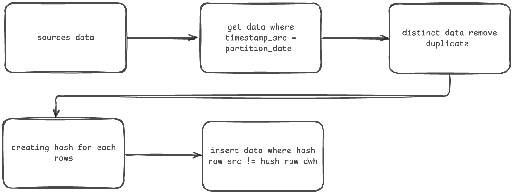
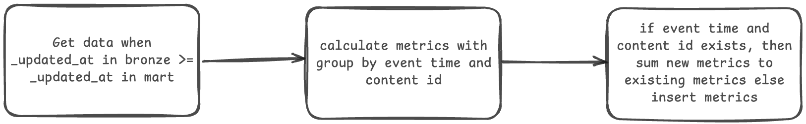
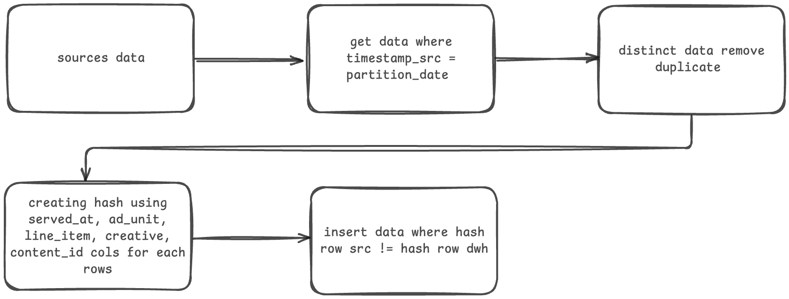

# Kapan Lagi Youniverse 

## How to Use
1. Expected the computer already have Python 3.11 and Docker
2. Run `docker-compose up` in the root dir
3. _Postgresql already up_
4. Open the `main.ipynb` notebook (can used Visual Studio Code with Jupyter Notebook extension installed, jupyterlab, or jupyterhub)
5. Run all cells in notebook

## Tech Stack
1. Python

    Used for handling ETL tasks by creating dedicated functions for each process. Later, this functions can used in Airflow, Dagster, Mage AI, or other orchestration tools as components.

2. SQL

    Used for creating data mart or gold layer after raw data in data warehouse.

3. PostgreSQL

    PostgreSQL choosed to solve this study case because have similar features like BigQuery. It supports using merge statement, CTE, partition, etc.

4. Docker

    PostgreSQL deployment.

## Study Case 1 - Articles Performance Pipeline

### Goals
- Creating data pipeline for inserting data from GA4 without duplication, idempotent, and handle late arrival data
- Creating metrics to calculate pageviews, session, and event engagement

### Flow

The sources data comes from CSV (_In real case GA4 can be retrieved through API / sync using BigQuery_) the first step is loads all data into dataframe. 

The script runs on a daily-partition basis, make this script able to perform backfill with / without using orchestration tools. 

For each partitioned date, the script ensures no duplicate rows exist by applying a `distinct` operation and generating a hash value (based on all columns) for each records to support validation and comparison. If hashrow already exists in database the skip the rows, if not then insert the rows data into data warehouse in staging / bronze area. 

With this hashrow, the script can re-run in certain partition without get duplicate data because it will insert data if the hashrow is not exists.

This script also automatically handle creating schema and table schema also generating complex query to re-usable in other task.

When creating metrics, there are condition when the raw data are late arriving. To get late arriving data, use the `_updated_at` column to filter the new data (`_updated_at` is when the data ingest to data warehouse, so even the `event_timestamp` is 2 Nov if it ingest to data warehouse at 3 Nov it will 3 Nov). Use grouping with `event_timestamp` and `content_id` columns as a key then counting and filter to calculate metrics. When `event_timestamp` and `content_id` is exists in mart table then update the existing data with `old data + new data` else just insert the new data into mart table.

### Suggestion
- Partition: use `_updated_at` as partition with day level to reduce cost because the `_updated_at` is column that often we use to filter data to create metrics
- Orchestration: use orchestration tools like Airflow, Dagster, Mage AI, etc to simply monitor our data pipeline and easily to perform backfill.
- Sources data: the data exporter from GA4 to BigQuery seems good to capture late arriving data as it will automatically sync. But, using API to get data seems good to since this script handle duplicate data perfectly and can be run on daily-partition

# Study Case 2 - Reconciliation Revenue from Ads

### Goals
- Creating data pipeline for inserting data from GAM
- Creating metrics to sum impression, click, and revenue
- Join with previous table (Opsional)

### Flow

The sources data comes from CSV, loads all of the data into dataframe. The script will run based on daily partition, make the script able to perform backfill with / without orchestration tools. 

For each partitioned date, the script ensures no duplicate rows exist by applying a `distinct` operation and generating a hashrow (from `served_at, ad_unit, line_item, creative, content_id` columns) for each rows using that used for validation and comparision. If hashrow already exists in database then skip the rows else insert the rows data into data warehouse in staging / bronze area. 

With this hasrow, the script can re-run in certain daily-partition without get duplication data because it will insert data if the hashrow is not exists.

This script also automatically handle creating schema and table schema also generating complex query to re-usable in other task.

When creating metrics, used the `_updated_at` column to filter and get the new data. Then, using grouping and sum statement with `served_at` and `content_id` as key id. If `served_at` and `content_id` exists in the mart table then update the existing data with `old data + new data` else just insert the new data into mart table.

Then, join the metrics with metrics from Study Case 1 and save as view table with name `daily_summary` (recommended materialize view).

### Suggestion
- Partition: use `_updated_at` as partition with day level to reduce cost because the `_updated_at` is column that often we use to filter data to create metrics
- Orchestration: use orchestration tools like Airflow, Dagster, Mage AI, etc to simply monitor our data pipeline, easily to perform backfill, etc